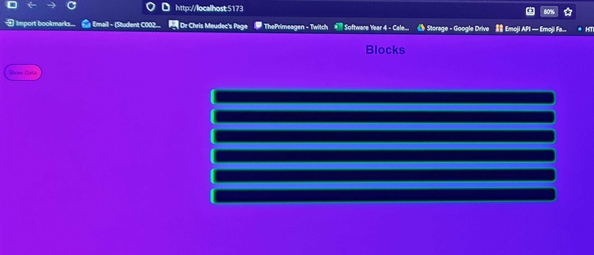
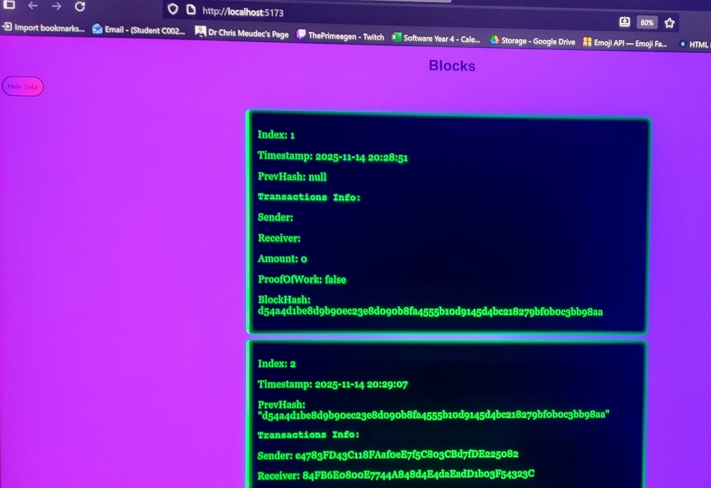
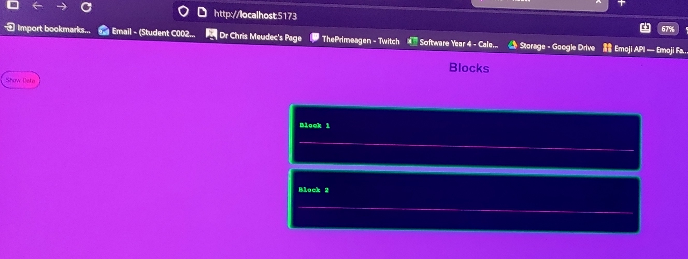
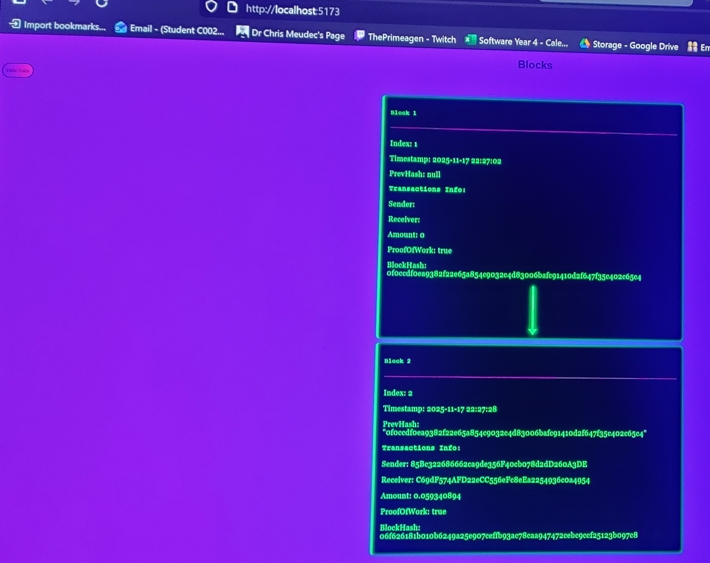

# BlockChain-Project-From-Scratch

## Table of Contents
- [Did I start this project a while ago](#Did-I-start-this-project-a-while-ago)
- [Why Have I Returned](#Why-Have-I-Returned)
- [What is this project](#What-is-this-project)
- [Technology Stack](#Technology-Stack)
- [Current Features](#Current-Features)
- [Potential Features](#Potential-Features)
- [Images of the project](#Images-of-the-project)
- [Video of the project so far](#Video-of-the-project-so-far)

## Did I start this project a while ago?

Short answer is, <strong>yes</strong>. I was working on this project after I was done my final semester of college. I started to make this project while I waited to get my college results. But once the results 
came out, I just stopped working on the project. This was back roughly at some time in June 2025.

## Why Have I Returned?

The main reason to why I returned to this project, is boredom. I was working on a project but now that project is complete. After I completed that project, I thought of two ideas:
  <ol>
    <li>A Game</li>
    <li>Job Application Tracker</li>
  </ol>
  .

## What is this project? 

## Technology Stack
### TODO

## Current Features
### TODO

## Potential Features
### TODO

## Images of the project
<!-- <h3>This image is how my project looked when I came back to it</h3> -->
<pre>Image 1:</pre>

todo

<pre>Image 2:</pre>

todo

<pre>Image 3:</pre>

todo

<pre>Image 4:</pre>

todo

<pre>Image 5:</pre>

todo

## Video of the project so far
### TODO
<a href="" placeholder="">this will be a link to youtube - this will be a video of my project so far...</a>
